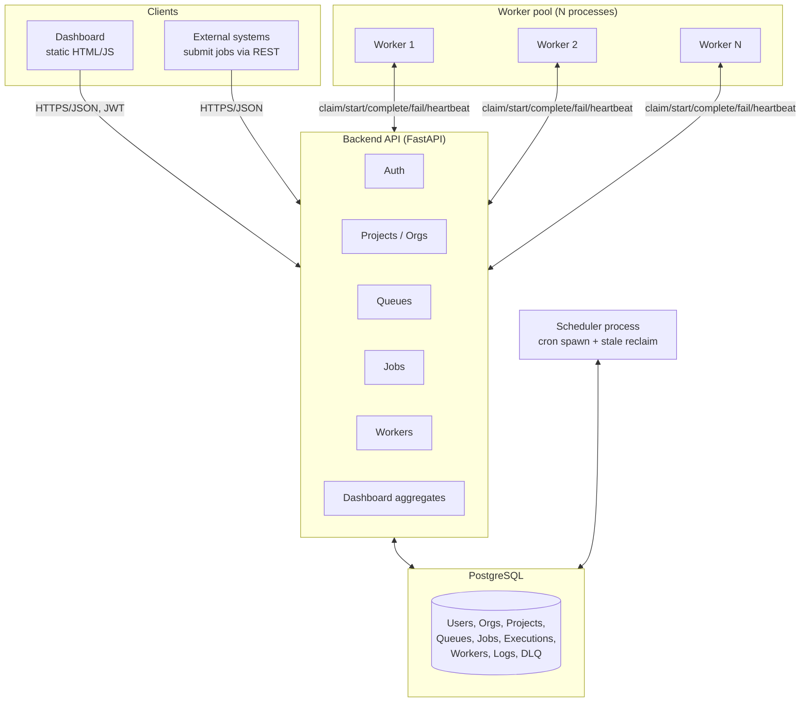
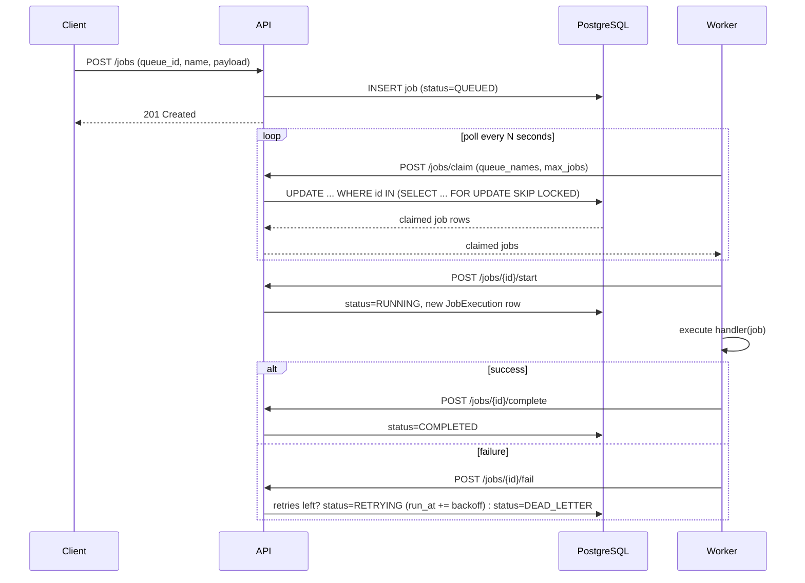

# Architecture

## System overview

## Why this shape

**Workers talk to the API, not the database directly.** Every worker action
(claim, start, complete, fail, heartbeat) goes through the REST API instead of
opening its own DB connection. This means:

- Workers can be written in any language, deployed on any machine, and scaled
  horizontally with zero coordination beyond hitting the same API.
- All the tricky concurrency logic (atomic claiming, retry/backoff math, DLQ
  transitions) lives in one place — `app/services/job_service.py` — instead of
  being duplicated in every worker implementation.
- The API can add caching, rate limiting, or auth in front of job claiming
  without touching worker code.

The tradeoff is an extra network hop per job-lifecycle event compared to a
worker with a direct DB connection. For a system whose bottleneck is job
*execution* time, not scheduling overhead, this is the right tradeoff — see
`DESIGN_DECISIONS.md`.

**The scheduler is a separate process from the API.** Recurring-job spawning
and stale-job reclamation are periodic background concerns, not
request/response concerns. Running them as their own process means:

- A slow or broken scheduler tick can't block API request handling.
- It can be scaled to exactly one replica (these operations are not
  parallel-safe in the way job claiming is) independent of how many API or
  worker replicas exist.

**Atomic claiming happens with `SELECT ... FOR UPDATE SKIP LOCKED`.** This is
a single SQL statement, not application-level locking (no Redis lock, no
advisory lock manager). Postgres itself guarantees no two workers ever get
the same row, and `SKIP LOCKED` means a busy worker never blocks another
worker's poll — they just skip past rows already being claimed. This is the
same technique used by mature queue-on-Postgres systems (e.g. `pgmq`,
Rails' Solid Queue).

## Request flow: submitting and running a job

## Deployment topology (docker-compose)

| Service | Replicas | Responsibility |
|---|---|---|
| `postgres` | 1 | Source of truth |
| `backend` | 1 (stateless, can scale) | REST API |
| `scheduler` | 1 (must not be scaled) | Recurring job spawn, stale reclaim |
| `worker-1`, `worker-2` | N (stateless, scale freely) | Job execution |
| `frontend` | 1 | Static dashboard |

Scaling the system under load means adding more `worker-*` replicas (and,
if the API itself becomes the bottleneck, more `backend` replicas behind a
load balancer — the API holds no in-memory state, so this is safe).

## Observability

Every job carries its full history: `job_executions` (one row per attempt,
with duration and result/error) and `job_logs` (a structured, timestamped
event stream: attempt started, retry scheduled, moved to DLQ, etc). The
dashboard's Job Explorer and Dead Letter Queue views read directly from
these tables, so "why did this job fail three times" is always answerable
without grepping worker logs.
