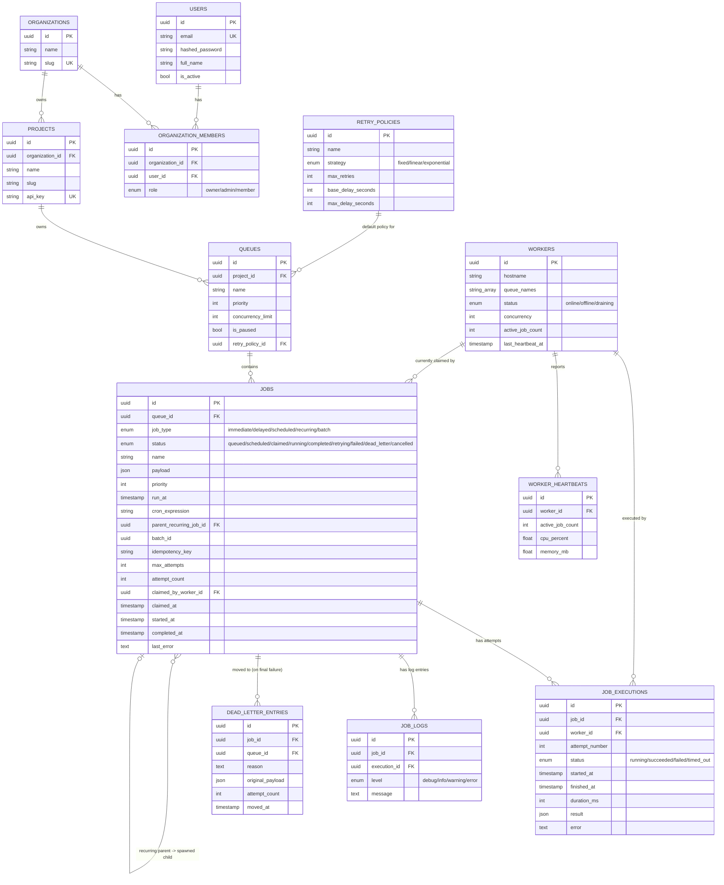

# Database Design (ER Diagram)

## Design notes

**Primary keys.** All tables use UUIDv4 primary keys instead of auto-increment
integers. This lets any component (API, worker, dashboard) generate an ID
client-side before the row exists, avoids leaking row counts, and makes
merging data across environments (e.g. replaying a DLQ entry from staging
into prod) safe since IDs can never collide.

**Foreign keys and cascade behavior.**
- `organization_members`, `projects`, `queues`, `jobs`, `job_executions`,
  `job_logs`, `dead_letter_entries` all cascade-delete with their parent
  (`ondelete="CASCADE"`) — deleting an organization cleans up everything
  under it, which matches "delete my account" / "delete my project" as a
  single, safe operation with no orphaned rows.
- `jobs.claimed_by_worker_id` and `job_executions.worker_id` use
  `ondelete="SET NULL"` instead of cascade — if a worker row is deleted
  (e.g. cleanup of old worker records), the historical fact that "this job
  was once claimed by worker X" shouldn't be destroyed, but the job/execution
  itself must survive independently of worker bookkeeping.
- `queues.retry_policy_id` is `SET NULL` for the same reason: deleting a
  retry policy shouldn't cascade-delete every queue that referenced it.

**Indexes.** The single most important index in the schema is the composite
`ix_jobs_claim_lookup` on `(queue_id, status, run_at)`. Every atomic-claim
query filters on exactly these three columns (`WHERE queue_id = ? AND status
IN (...) AND run_at <= now()`), so this index is what keeps claiming O(log n)
instead of a sequential scan as the `jobs` table grows into the millions of
rows. Secondary indexes exist on every foreign key (for join performance) and
on `idempotency_key` (for the duplicate-submission check on the write path).

**Normalization.** The schema is in 3NF: `retry_policies` is extracted into
its own table rather than duplicating strategy/backoff columns on every
`queue` row, because policies are meant to be reused across many queues
(e.g. one "aggressive-retry" policy shared by all payment-related queues).
`job_executions` is a separate table from `jobs` (1-to-many) rather than a
`retry_history` JSON blob on `jobs`, so that individual attempts can be
queried, filtered, and joined efficiently (e.g. "average duration of
successful executions in the last 24h").

**Why `job_logs` is separate from `job_executions`.** An execution row is
one attempt's structured outcome (status, duration, result/error) — cheap,
bounded, always exactly `attempt_count` rows per job. `job_logs` is an
unbounded, append-only event stream (arbitrary text messages at info/warn/
error level) that a real job handler could also write to mid-execution for
progress reporting. Keeping them separate means the hot `job_executions`
table (queried constantly for retry math and dashboards) never grows
unpredictably large the way a log stream would.

**Performance considerations at scale.** The two things worth calling out
for a production deployment beyond what's implemented here:
1. **Partitioning `jobs` / `job_logs` by month** once volume passes tens of
   millions of rows — completed/dead-lettered jobs older than N days are
   rarely queried and can move to cold storage.
2. **A covering index or materialized view for `dashboard/throughput`** —
   the current implementation runs a live `GROUP BY date_trunc('hour', ...)`
   query, which is fine at moderate volume but would benefit from a
   pre-aggregated rollup table if dashboards are polled frequently at scale.
